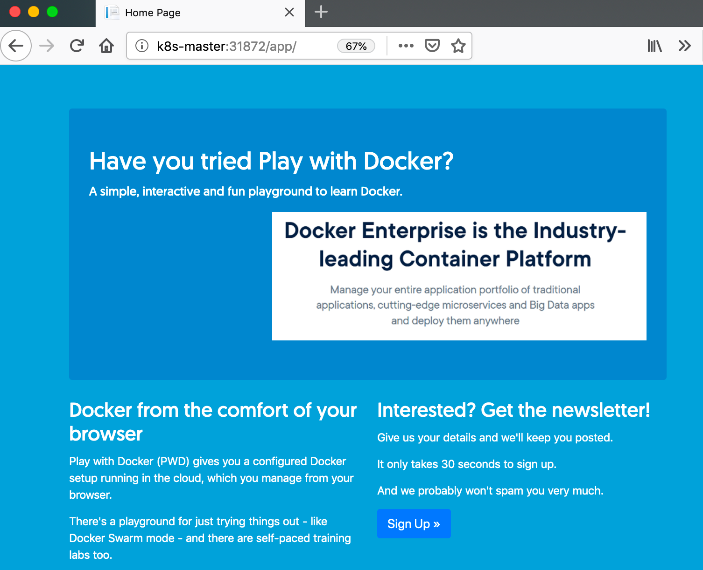
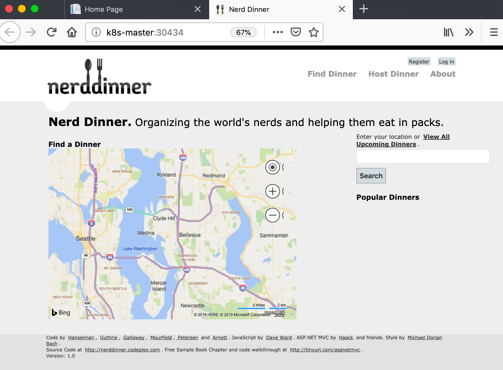

# Sample Windows Apps

A couple of samples to get started on your Kubernetes cluster.

## Newsletter Signup

An ASP.NET WebForms app running in a Windows pod, using a SQL Server database running in a Linux pod. 

> This is the demo app from my [Docker on Windows workshop](https://dwwx.space)

Deploy the app:

```
kubectl apply -f ./dwwx/
```

Get the the node port for the service:

```
kubectl get svc signup-web
```

Browse to the port at path `/app` and you should see the homepage:



## Nerd Dinner

The legendary ASP.NET demo app. Running in a Windows pod and connecting to a SQL Server database in another Windows pod.

> This version is from the [Chapter 3 source code](https://github.com/sixeyed/docker-on-windows/tree/second-edition/ch03) of my book [Docker on Windows](https://amzn.to/2yxcQxN)

Nerd Dinner uses Bing Maps, so for full functionality you need to add your Bing Maps API Key to `./nerd-dinner/secrets/appSettings.config`.

Deploy the config files as a secret:

```
kubectl create secret generic nerd-dinner-config --from-file=./nerd-dinner/secrets/appSettings.config --from-file=./nerd-dinner/secrets/connectionStrings.config
```

Deploy the app:

```
kubectl apply -f ./nerd-dinner/
```

Get the the node port for the service:

```
kubectl get svc nerd-dinner-web
```

Browse to the port and you'll see the homepage:

